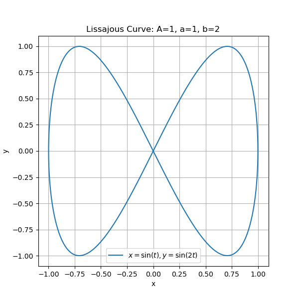

# EKFPROJECT
SC649 Course Project\
 The goal of this project is to implement an Extended Kalman Filter (EKF) for estimating
 the pose of a robot in a 2D plane. The robot starts at the pose (0, 0, 0), with three known
 landmarks placed at specific coordinates. The EKF will be used to estimate the robot’s
 pose based on trilateration data, and the robot will track a trajectory.
 
## Trajectory
Trajectory is Lissajous curve\
x(t) = Asin(at+delta)\
y(t) = Bsin(bt)\
A = B = 1.0 Amplitudes\
a = 1, b = 2 Frequencies\

 
## Updated scripts:
- controller3.py\
Implements a EKF for pose estimation and simple proportional control for trajectory following.
- vis2.py\
Image is saved iteratively to avoid backend runtime issues for live visualisation. Can view live from VS code.
